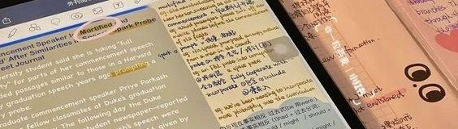

## Hi there! 👋 I'm Maria

  

</h1>

### 🌟 A passionate software developer from Brazil 🇧🇷 

 

I'm currently working on a **web app focused on tree registration** 🌳 and diving into **React.js** 🚀. 

**Fun fact**: I'm a polyglot! 🌍

---

## 🌐💻 Languages and Frameworks Tools

##

## 🚀 Languages & Frameworks I Ought to Explore 🚀

| Linguagens             | Frameworks & Bibliotecas | Ferramentas & Tecnologias |
|:-----------------------:|:------------------------:|:-------------------------:|
| - [ ] Flutter              | - [ ] Angular              | - [ ] Docker              |
| - [ ] Go                | - [ ] Vue.js             | - [ ] Kubernetes          |
| - [ ] Kotlin            | - [ ] Django             | - [ ] GraphQL            |
| - [ ] Java             | - [ ] Spring Boot        | - [ ] Terraform           |

 

## 💬 Let's Connect!

  Feel free to reach out: 

   

  
  

<!--

<h2>My Contributions</h2>
  
-->